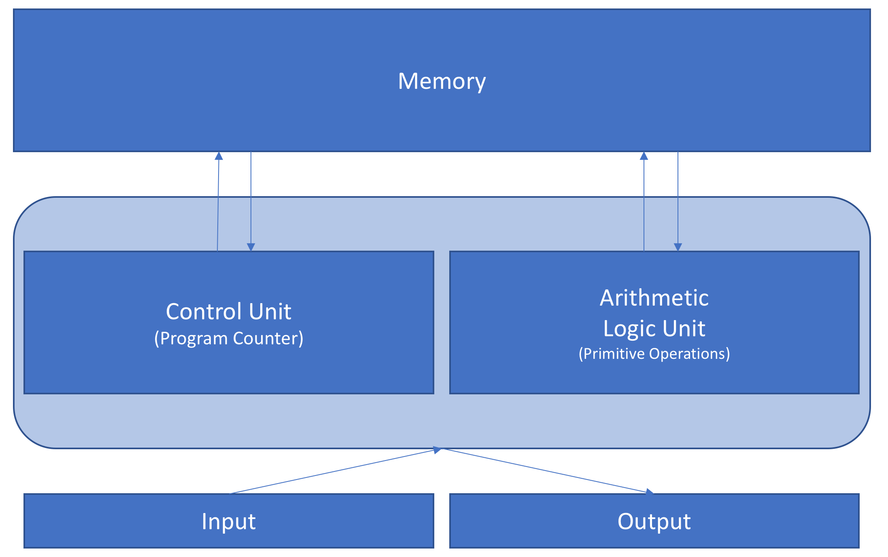
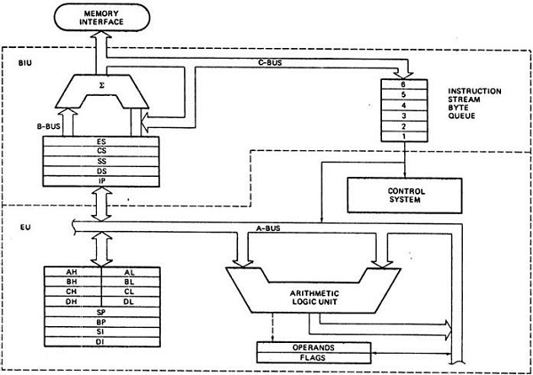

# Fastcampus Data Science Extension SCHOOL
## Computer Science && Python

---
<!--
page_number: true
$size: A4
footer : fastcampus 데이터 사이언스 Extension 스쿨, Wooyoung Choi, 2018
-->

## Introduce
### 최우영

- Developer, Co-founder at Disceptio
- Solution Architect, Web Developer, Instructor
- Publish: Python Web Crawling Bootcamp(gilbut,2019)
- Skills: Python, Golang, Julia, Node.js, Google tag manager ...

#### blog: https://blog.ulgoon.com/
#### github: https://github.com/ulgoon/
#### email: me@ulgoon.com


---

## Index
- Computer Science
- Python
- RegEx
- Shell command, vim, git
- Network, Web scraping
- Database
- Cloud service

---
## Computer Science

---
### Computer Science and Engineering
- 컴퓨터의 소프트웨어를 다루는 학문
- 컴퓨터라는 물리적 기기를 연구하는 것이 아닌 `Compute`r 의 개념과 구조를 이해하고 구현하는 학문

---
### Computation vs Calculation

`"calculation"` implies a strictly arithmetic process, 
whereas `"computation"` might involve applying rules in a systematic way

---
### Computer vs Calculator

- `Stored Program` computer -> Computer
	- Stores and Executes intructions
- `Fixed Program` computer -> Calculator
	- just calculate 

엇? 그럼 공학용 계산기는???

---
### Computational Thinking
> 정답이 정해지지 않은 문제에 대한 해답을 일반화하는 과정

---
### Process of Computational Thinking
1) 문제 조직화(추상화) - Problem Formulation (abstraction)
2) 솔루션 구현(자동화) - Solution Expression (automation)
3) 솔루션 실행 및 평가(분석) - Solution Execution & Evaluation (analyses)

---
### Characteristics of Computational Thinking
- 문제 분해(decomposition)
- 패턴인지 / 데이터 표현(pattern recognition / data representation)
- 일반화 / 추상화(generalization / abstraction)
- 알고리즘(algorithms)

---
### Computational Thinking Process

- 문제인지
	- `배가 고프다`

---
### Computational Thinking Process

- 문제조직화
	- 문제분해
		- `뭘 먹긴 해야겠다`
			- `집에서 해결함`
				- `냉장고엔 뭐가있지? 밥은 해놨나? 라면이라도 먹을까? ...`
			- `나가서 해결함` 
				- `편의점? 식당? 패스트푸드? 레스토랑??`


---
### Computational Thinking Process

- 패턴인지
	- `아! 배가고프면 어디서 뭔가를 먹음으로써 Hunger가 False가 되는구나` 
- 일반화/추상화
	- 추상화(간결하고 명확하게 단순화, 일반화, 개념화)
		- `배가 고프면`: `{{어디}}`에서 `{{어떻게}}`해결함
	- 알고리즘

---
### Computational Thinking Process


---
### Computational Thinking Process
- 솔루션구현
- 솔루션실행 및 평가
	- `솔루션대로 실행해서 나는 배고픔을 인지하고 해결하게 되었다.`
	- `돈 보유량에 따라 다양한 선택지를 둬야겠다`
	- `집에서 밥이 없으면 굶지말고 밥을 해야겠다.`

---
## Pseudocode

---
### Pseudocode

== 의사코드 != Doctorcode

---
### So, pseudocode is,
> 가짜코드: 프로그램이나 알고리즘이 수행할 내용을 인간이 이해할 수 있는 언어로 표현하는 것

---
## Let's make fizzbuzz

---
### fizzbuzz
1 부터 n 까지 반복하면서,
3의 배수는 "fizz"
5의 배수는 "buzz"
15의 배수는 "fizzbuzz"
나머지는 숫자

---
### ...

---
### pseudocode는 프로그램을 설계할 때 밑그림의 역할을 하게 됩니다!

---
### 목적과 수행과정이 명확해 코드 수정과 분해가 편리합니다!

---
### pseudocode가 comment의 역할을 수행할 수 있습니다.

---
### How to write pseudocode?

---
### nonstandard..

> 자신이 작성할 언어의 스타일에 맞춰 작성하면 끝!

---
### I'm still hungry
```
1. hunger가 true가 됨
2. 돈이 없고, 현재위치가 집일때,
	1. 밥솥에 밥이 있다면, 해결한다.
	2. 굶는다.
3. 돈이 있고, 현재위치가 밖일때,
	1. 현금이 10만원 초과라면, 레스토랑을 간다.
	2. 현금이 10만원 이하라면, 편의점을 간다.
```

---
### Let's make fizzbuzz again

---
### fizzbuzz
1 부터 n 까지 반복하면서,
3의 배수는 "fizz"
5의 배수는 "buzz"
15의 배수는 "fizzbuzz"
나머지는 숫자

> 영어로 작성하면 더 좋지만.. 한글로!

---
### fizzbuzz
```
1. 사용자로부터 숫자 하나를 받아 n에 할당한다.
2. 1부터 n까지 숫자를 진행시키면서,
	3. 만약에 해당숫자가 15의 배수라면, "fizzbuzz"를 출력한다.
	4. 만약에 해당숫자가 3의 배수라면, "fizz"를 출력한다.
	5. 만약에 해당숫자가 5의 배수라면, "buzz"를 출력한다.
	6. 3,4,5의 경우를 만족하지 못한 경우, 해당숫자를 그대로 출력한다.
```

---
### fizzbuzz-Kor

```
1. 사용자에게 정수 하나를 입력받아 num에 선언한다. i는 1임.
2. 1 부터 num까지 반복하면서
3. 만약 그 수(i)가 3의 배수라면 "fizz"를 출력
4. 만약 그 수가 5의 배수라면 "buzz"를 출력
5. 만약 그 수가 15의 배수라면 "fizzbuzz"를 출력
6. 3,4,5의 경우를 만족하지 못한 나머지 경우 그 수를 출력

```

---
### fizzbuzz - Eng
```
1. get integer from user ==> num, i == 1
2. WHILE i is less than or equal to num
3. if i is divisible by 3, print "fizz"
4. if i is divisible by 5, print "buzz"
5. if i is divisible by 15, print "fizzbuzz"
6. else, print i
```

---
### fizzbuzz - python
```python
num = int(input("get number for fizzbuzz: "))
i=1
while i <= num:
	if i % 3 == 0:
		print("fizz")
	elif i % 5 == 0:
		print("buzz")
	elif i % 15 == 0:
		print("fizzbuzz")
	else:
		print(i)
```

---
### 그럼, 부가가치세를 계산해봅시다.

---
## VAT
- Korea: 10%
- Japan: 8%
- USA: 주마다 다름
- UK: 20%

제품 가격과 나라에 따라 다른 부가가치세를 계산해 그 가격을 보여주도록!

---
### VAT - answer
```
1. get price of item ==> item_price
2. set tax rate (kor == 0.1, jap == 0.08, usa == "depend on state", uk == 0.2)
3. get contry code(example: kor, jap, usa, uk) ==> contry_code
4. tax_rate is matched price with contry_code
5. sales tax is item_price times tax rate
5. total price is item_price plus sales tax
```

---
### Computer


---
### Patch & Debug

---


---
### Basic Computer Architecture


---
### Basic Computer Architecture
- Program Counter - contains the address (location) of the instruction being executed at the current time
- ALU(Arithmetic Logic) - `+, -, *, /, AND, OR, NOT, `

---


---
### 8086 Architecture



---
## Python Basic

---
## Python Basic

### Python은? 
> 1989년 크리스마스 연휴를 보내던  Guido van Rossum이 만든 고급 프로그래밍 언어

### 특징
- 인터프리터
- 객체지향
- 동적타이핑
- 엄격한 문법

---
### C vs Python
```c
int main(){
int num;
for(i=0;i<=10;i++){
if (i % 2 == 0){
        	
}
}
}
```

```python
for i in range(1,10+1):
	if i % 2 == 0:
	    	print(i)
```

---
## Python Basic

Python으로 할 수 있는 것들!
- System Programming
- Web Programming
- Data Analysis
- ...

---
## Let's install Python!
<iframe width="560" height="315" src="https://www.youtube.com/embed/AjGfUfW8njE" frameborder="0" allow="accelerometer; autoplay; encrypted-media; gyroscope; picture-in-picture" allowfullscreen></iframe>

### MacOS
- install brew(brew.sh)
- `$ brew install python`

---
## Zen of Python - PEP 20
```python
>>> import this
```

The Zen of Python, by Tim Peters

**Beautiful** is better than ugly.
Explicit is better than implicit.
**Simple** is better than complex.
Complex is better than complicated.
**Flat** is better
Sparse is better than dense.
**Readability** counts.


---
## Python Basic

### REPL : Read - Eval - Print Loop
코드를 입력하면 바로 결과를 확인할 수 있음!!

```
>>> print("hello python!")
hello python!
```

### We'll use python3

[difference of 2.x , 3.x](https://wiki.python.org/moin/Python2orPython3)
Short version: Python 2.x is legacy, Python 3.x is the present and future of the language

---
### Jupyter Notebook
```shell
$ pip install jupyter
$ pip list
```
```shell
$ jupyter notebook
```
---
## Hello python!

So, let's try!!

```python
print("hello python!")
```

---
## Numbers & Math
`<object> <operator> <object>`
```python
print(3 + 7)
print(10 - 3)
print(15 / 7)
print(34 * 100)
```

---
## Numbers & Math
```python
print(15 / 7)
print(15 / 5)
type(15 / 5)

print(15 // 5)
type(15 // 5)

print(7 % 3)

print(15 ** 3)

print(34 * 100)
print(3 * 2.5)
type(3 * 2.5)
```

---
## Boolean

```python
print(3 < 7)
print(10 < 3)
print(15 > 7)
print(3 >= 3)
print(3 <= 10)
print(34 == 100)
print(34 != 100)

```

---
## Variable

```python
print("hello python!")
hello = "hello"
python = "python!"
print(hello, python)
```
```python
num1 = 14
num2 = 5

print(num1+num2)
print(num1-num2)
print(num1*num2)
print(num1/num2)
```

---
## Small Project
반지름(`r=10`)을 선언한 뒤, 이를 이용하여 원의 지름, 둘레, 넓이, 구의 겉넓이, 부피를 각각 출력하는 파이썬 파일을 만들어보세요.(`pi=3.1415`)

**sample output**
```
r = 10 ==> print("r =", r)
d = 20
c = 62.830
a = 314.15
gnb = 1256.0000
v = 4188.666666666667
```

<link href="https://fonts.googleapis.com/css?family=Nanum+Gothic:400,800" rel="stylesheet">
<link rel='stylesheet' href='//cdn.jsdelivr.net/npm/hack-font@3.3.0/build/web/hack-subset.css'>

<style>
h1,h2,h3,h4,h5,h6,
p,li, dd {
font-family: 'Nanum Gothic', Gothic;
}
span, pre {
font-family: Hack, monospace;
}
</style>